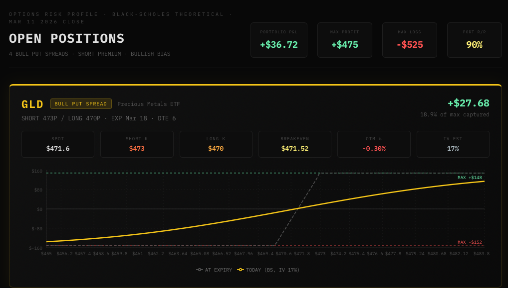

# schwab-mcp



Multi-tenant [MCP](https://modelcontextprotocol.io/) server exposing Charles Schwab brokerage data to AI agents via [FastMCP](https://github.com/jlowin/fastmcp). Monetized via [Tollbooth DPYC](https://github.com/lonniev/tollbooth-dpyc)&trade; Lightning micropayments. Serves over **Streamable HTTP** with direct async httpx calls to `api.schwabapi.com`.

> Don't Pester Your Customer&trade; (DPYC&trade;) &mdash; API monetization for Entrepreneurial Bitcoin Advocates

*Inspired by [The Phantom Tollbooth](https://en.wikipedia.org/wiki/The_Phantom_Tollbooth) by Norton Juster, illustrated by Jules Feiffer (1961).*

## Tools

### Brokerage (paid — credit-gated)

| Tool | Cost | Description |
|------|------|-------------|
| `get_positions` | 5 api_sats | Portfolio positions with automatic options spread detection (bull put / bear call) |
| `get_balances` | 5 api_sats | Cash, buying power, net liquidation value, day P&L |
| `get_quote` | 5 api_sats | Real-time quotes for one or more symbols |
| `get_option_chain` | 10 api_sats | Filtered option chain with Greeks, IV, OTM%, and OI threshold |
| `get_price_history` | 10 api_sats | Historical OHLCV candle data |
| `get_orders` | 15 api_sats | Order history with multi-leg spread support (default 30 days) |
| `get_order` | 8 api_sats | Single order detail by ID |
| `get_transactions` | 15 api_sats | Transaction history — trades, dividends, cash movements (default 30 days) |
| `get_transaction` | 8 api_sats | Single transaction detail by ID |

### Free

| Tool | Description |
|------|-------------|
| `session_status` | Check current session and DPYC&trade; identity state |
| `begin_oauth` | Start OAuth2 flow — returns Schwab authorization URL |
| `check_oauth_status` | Poll whether OAuth flow completed and session is active |
| `request_credential_channel` | Open a Secure Courier channel for credential delivery via Nostr DM |
| `receive_credentials` | Pick up credentials from the encrypted vault |
| `forget_credentials` | Delete vaulted credentials for re-delivery |
| `check_balance` | View credit balance and usage |
| `purchase_credits` | Create a Lightning invoice to buy credits |
| `check_payment` | Verify Lightning payment and credit the balance |

All brokerage tools are read-only. No orders are placed.

## Architecture

- **Multi-tenant**: operator delivers `app_key` / `secret` via Secure Courier (`service="schwab-operator"`); each user delivers `token_json` + `account_hash` via Secure Courier (`service="schwab"`). No Schwab credentials in env vars
- **Direct httpx**: thin `SchwabClient` wrapper with bearer auth and proactive token refresh (no third-party Schwab SDK)
- **Tollbooth DPYC&trade;**: pre-funded Lightning balances, Authority-certified purchase orders, NeonVault (Postgres) for ledger persistence
- **Registry discovery**: OAuth2 collector URL resolved from DPYC&trade; registry at runtime (no `OAUTH_COLLECTOR_URL` env var needed)

---

## Getting Started

This guide covers the full Tollbooth onboarding path — from generating a Nostr identity to making your first brokerage data call. It applies to both **Operators** (who deploy schwab-mcp) and **Patrons** (who consume it through Claude.ai or another MCP client).

### 1. Get a Nostr Identity (npub)

Every participant in the DPYC&trade; ecosystem is identified by a **Nostr keypair** — no email, no password, no vendor lock-in.

**What is an npub?** It's a public key in the [Nostr protocol](https://nostr.com/), encoded as a bech32 string starting with `npub1...`. Your corresponding private key (`nsec1...`) stays on your device. The npub is safe to share — it's how the system knows who you are.

**How to generate one:**

1. Install [Oxcart](https://github.com/nickkawai/Oxcart) (the preferred Nostr client for DPYC&trade; workflows; other clients have not been tested)
2. Create an account — the app generates your keypair automatically
3. Find your npub in the app's profile/settings screen (it starts with `npub1...`)

Alternatively, use a CLI key generator like [nak](https://github.com/fiatjaf/nak): `nak key generate`

**Operators** should keep a separate npub for their service identity, distinct from their personal Nostr account.

### 2. Register as a DPYC&trade; Citizen

Before you can buy credits or operate a service, register your npub with the DPYC&trade; community:

1. In Claude.ai (with the [DPYC Oracle](https://github.com/lonniev/dpyc-oracle) connected), call `how_to_join()` to learn about citizenship
2. Follow the Oracle's instructions to register your npub

Citizenship is free and gives you a portable identity across the entire Tollbooth network.

### 3. For Operators — Set Up Your BTCPay Store

The Operator collects Lightning payments from Patrons via [BTCPay Server](https://btcpayserver.org/). You need:

- A BTCPay Server instance (self-hosted or hosted by your Authority)
- A **Store ID** and **API Key** with invoice creation permissions

Set these as environment variables (`BTCPAY_HOST`, `BTCPAY_STORE_ID`, `BTCPAY_API_KEY`) in your deployment.

### 4. For Operators — Register with a Tollbooth Authority

Every Operator is sponsored by an Authority in the DPYC&trade; trust chain. The Authority certifies your purchase orders and collects a small fee (default 2%).

1. Connect to your Authority's MCP service (e.g., [tollbooth-authority](https://github.com/lonniev/tollbooth-authority))
2. Call `register_operator(npub=<your_operator_npub>)` — creates your ledger entry
3. The Authority approves your registration

### 5. For Operators — Fund Your Certification Balance

Before your service can issue credits to Patrons, you need cert-sats:

1. Call `authority_purchase_credits(amount_sats=1000)` on your Authority — returns a Lightning invoice
2. Pay the invoice with any Lightning wallet
3. Call `authority_check_payment(invoice_id="...")` — confirms settlement and credits your balance

Your cert-sat balance is consumed automatically when Patrons purchase credits from your service.

### 6. For Operators — Deliver Schwab API Credentials (Secure Courier)

The Operator must register a [Schwab Developer](https://developer.schwab.com/) app and deliver the API credentials via Secure Courier. Credentials **never appear in chat**.

1. Call `request_credential_channel(service="schwab-operator", recipient_npub=<operator_npub>)` — a welcome DM arrives in your Nostr client ([Oxcart](https://github.com/nickkawai/Oxcart))
2. In Oxcart, reply to the DM with: `{"app_key": "YOUR_APP_KEY", "secret": "YOUR_SECRET"}`
3. Call `receive_credentials(sender_npub=<operator_npub>, service="schwab-operator")` — credentials are vaulted

This is a one-time setup per deployment.

### 7. For Patrons — Buy Credits (api_sats)

Patrons pre-fund a satoshi balance and consume brokerage tools against it — no per-request payment interruptions. This is the Don't Pester Your Customer&trade; philosophy in action.

1. Call `purchase_credits(amount_sats=500)` — returns a Lightning invoice with a checkout link
2. Pay the invoice with any Lightning wallet (Phoenix, Breez, Zeus, etc.)
3. Call `check_payment(invoice_id="...")` — confirms settlement and credits your balance

Your balance depletes as you call paid tools. Recharge anytime with another `purchase_credits` call. Check your balance at any time with `check_balance` (free).

### 8. For Patrons — Deliver Your Schwab OAuth Token

You need to authorize schwab-mcp to read your Schwab account. Choose one method:

**Option A — OAuth Flow (recommended):**

1. Call `begin_oauth(patron_npub=<your_npub>)` — returns a Schwab authorization URL
2. Open the URL in your browser and log in to Schwab
3. Schwab redirects back to the server — token exchange happens automatically
4. Call `check_oauth_status()` to confirm your session is active

No curl commands, no copy-paste. Your credentials never appear in the chat.

**Option B — Manual Secure Courier:**

If the OAuth redirect is unreachable (e.g., firewalled local dev), you can deliver credentials manually via encrypted Nostr DM. See the [tollbooth-oauth2-collector](https://github.com/lonniev/tollbooth-oauth2-collector) companion repo for full instructions on generating `token_json` + `account_hash`, then:

1. Call `request_credential_channel(recipient_npub=<your_npub>)` — a welcome DM arrives in Oxcart
2. Reply with: `{"token_json": "<full token JSON>", "account_hash": "<hashValue>"}`
3. Call `receive_credentials(sender_npub=<your_npub>)` — session activates

### 9. Using Schwab Tools in Conversation

Once your session is active, ask your AI agent naturally:

- *"Show me my positions"* — calls `get_positions` (5 api_sats)
- *"What's my account balance?"* — calls `get_balances` (5 api_sats)
- *"Get a quote for AAPL and MSFT"* — calls `get_quote` (5 api_sats)
- *"Show me the GLD option chain for next month"* — calls `get_option_chain` (10 api_sats)
- *"What are my recent orders?"* — calls `get_orders` (15 api_sats)
- *"Show me my trade history for the last week"* — calls `get_transactions` (15 api_sats)

Free tools are always available:

- *"What's my schwab-mcp balance?"* — calls `check_balance`
- *"Show me my account statement"* — calls `account_statement`

---

## DPYC&trade; Community Resources

| Resource | Description |
|----------|-------------|
| [dpyc-community](https://github.com/lonniev/dpyc-community) | Community registry, governance, creed, and trademarks |
| [tollbooth-dpyc](https://github.com/lonniev/tollbooth-dpyc) | Operator SDK — Python library for Tollbooth DPYC&trade; monetization |
| [tollbooth-authority](https://github.com/lonniev/tollbooth-authority) | Authority MCP service — fee collection, Schnorr signing, purchase order certification |
| [thebrain-mcp](https://github.com/lonniev/thebrain-mcp) | Personal Brain MCP service — the first city on the Lightning Turnpike |
| [excalibur-mcp](https://github.com/lonniev/excalibur-mcp) | X (Twitter) posting service with Secure Courier |
| [dpyc-oracle](https://github.com/lonniev/dpyc-oracle) | Community concierge — free membership, governance, and onboarding tools |
| [DPYC Whitepaper](https://github.com/lonniev/dpyc-community/blob/main/docs/WHITEPAPER.md) | Technical whitepaper for the Tollbooth architecture |
| [The Phantom Tollbooth on the Lightning Turnpike](https://stablecoin.myshopify.com/blogs/our-value/the-phantom-tollbooth-on-the-lightning-turnpike) | Narrative introduction to Tollbooth DPYC&trade; |

---

## Setup (Developer)

### Prerequisites

- Python 3.11+
- A [Schwab Developer](https://developer.schwab.com/) app with API credentials
- [Oxcart](https://github.com/nickkawai/Oxcart) Nostr client for Secure Courier credential delivery

### Install

```bash
uv sync            # or: pip install -e ".[dev]"
```

### Environment Variables

See [`.env.example`](.env.example) for the full list. Key variables:

| Variable | Required | Description |
|----------|----------|-------------|
| `SCHWAB_TRADER_API` | No | API base URL (default `https://api.schwabapi.com`) |
| `TOLLBOOTH_NOSTR_OPERATOR_NSEC` | Yes | Nostr signing key for Secure Courier |
| `NEON_DATABASE_URL` | Yes | Postgres for NeonVault (ledger + credential persistence) |
| `BTCPAY_HOST` / `BTCPAY_STORE_ID` / `BTCPAY_API_KEY` | Yes | BTCPay Server for Lightning invoices |

All Schwab credentials flow exclusively through Secure Courier:
- **Operator** delivers `app_key` + `secret` via `service="schwab-operator"` (one-time, mapped internally to client_id/client_secret)
- **Patron** delivers `token_json` + `account_hash` via `service="schwab"` (per-user)

No Schwab secrets ever appear in env vars or chat.

## Run

```bash
python server.py
```

The server binds to `0.0.0.0:8000` and serves MCP over Streamable HTTP.

### Verify

```bash
curl http://localhost:8000/mcp
```

## Tests

```bash
uv run pytest tests/ -v
```

## Project Structure

```
schwab-mcp/
  server.py            # FastMCP server, singletons, credit gating, 18 tool endpoints
  schwab_client.py     # Thin async httpx client — bearer auth + token refresh
  vault.py             # Per-user session management (in-memory cache)
  auth.py              # CLI bootstrap message (credentials via Secure Courier)
  oauth_flow.py        # OAuth2 authorization code flow (state tokens, exchange, callback)
  settings.py          # pydantic-settings (env vars, .env file)
  models.py            # Pydantic response models
  tools/
    account.py         # Positions, balances, orders, transactions (spread detection)
    market.py          # Quotes + price history
    options.py         # Option chain retrieval + filtering
  tests/
    test_schwab_client.py  # httpx client, token refresh, URL building
    test_server.py         # Singletons, credit gating, Secure Courier callback
    test_vault.py          # Session management
    test_auth.py           # Client creation
    test_account.py        # Position, balance, order, transaction parsing
    test_market.py         # Quote + price history formatting
    test_options.py        # Option chain filtering
```

## Prior Art & Attribution

The methods, algorithms, and implementations contained in this repository may represent original work by Lonnie VanZandt, first published on March 11, 2026. This public disclosure establishes prior art under U.S. patent law (35 U.S.C. 102).

All use, reproduction, or derivative work must comply with the Apache License 2.0 included in this repository and must provide proper attribution to the original author per the [NOTICE](NOTICE) file.

### How to Attribute

If you use or build upon this work, please include the following in your documentation or source:

    Based on original work by Lonnie VanZandt and Claude.ai
    Originally published: March 11, 2026
    Source: https://github.com/lonniev/schwab-mcp
    Licensed under Apache License 2.0

Visit the technologist's virtual cafe for Bitcoin advocates and coffee aficionados at [stablecoin.myshopify.com](https://stablecoin.myshopify.com).

### Patent Notice

The author reserves all rights to seek patent protection for the novel methods and systems described herein. Public disclosure of this work establishes a priority date of March 11, 2026. Under the America Invents Act, the author retains a one-year grace period from the date of first public disclosure to file patent applications.

**Note to potential filers:** This public repository and its full Git history serve as evidence of prior art. Any patent application covering substantially similar methods filed after the publication date of this repository may be subject to invalidation under 35 U.S.C. 102(a).

## Further Reading

[The Phantom Tollbooth on the Lightning Turnpike](https://stablecoin.myshopify.com/blogs/our-value/the-phantom-tollbooth-on-the-lightning-turnpike) — the full story of how we're monetizing the monetization of AI APIs, and then fading to the background.

## Trademarks

DPYC&trade;, Tollbooth DPYC&trade;, and Don't Pester Your Customer&trade; are trademarks of Lonnie VanZandt. See the [TRADEMARKS.md](https://github.com/lonniev/dpyc-community/blob/main/TRADEMARKS.md) in the dpyc-community repository for usage guidelines.

## License

Apache License 2.0 — see [LICENSE](LICENSE) and [NOTICE](NOTICE) for details.

---

*Because in the end, the tollbooth was never the destination. It was always just the beginning of the journey.*
